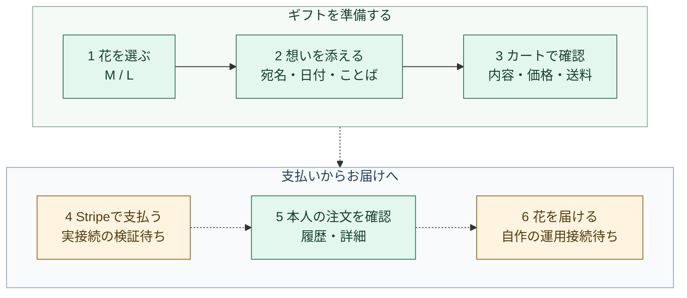
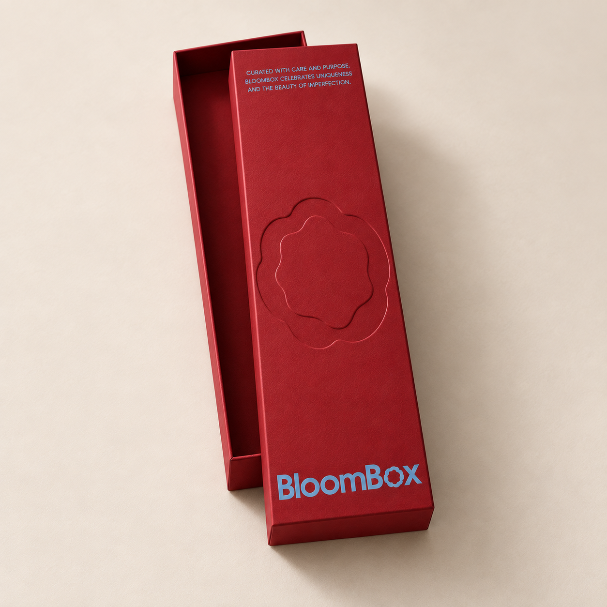
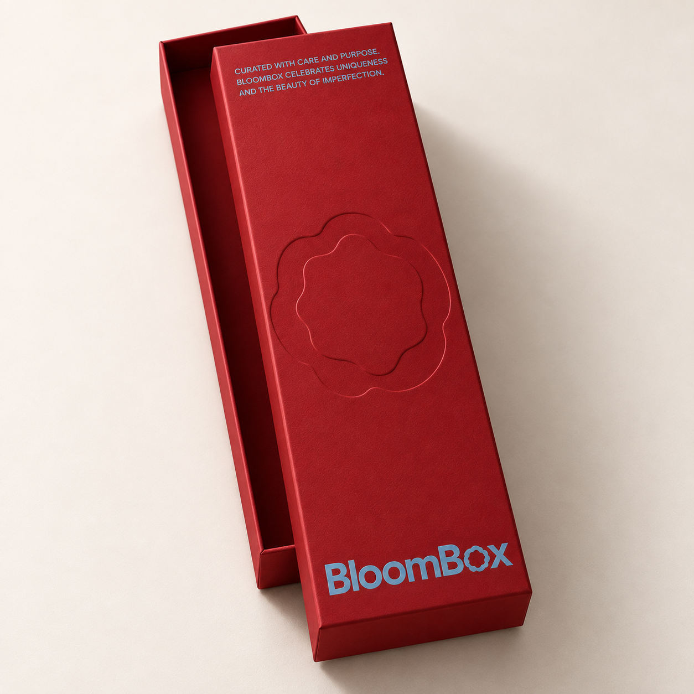
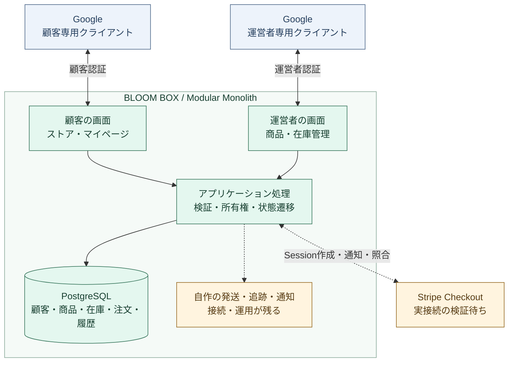
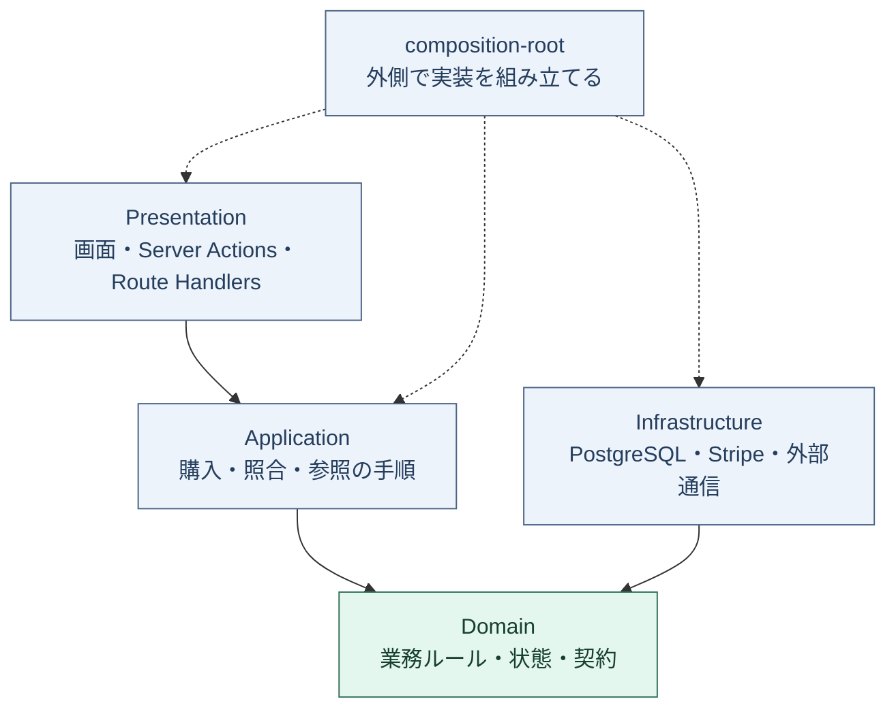
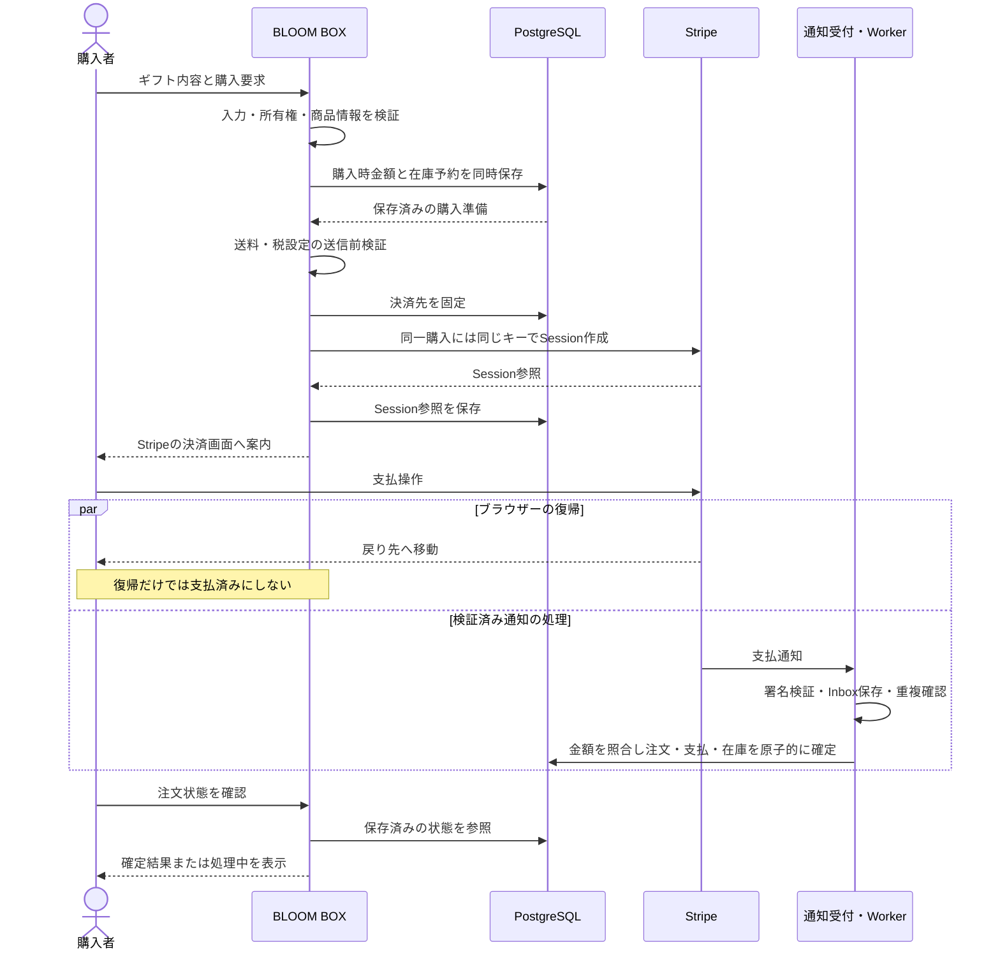
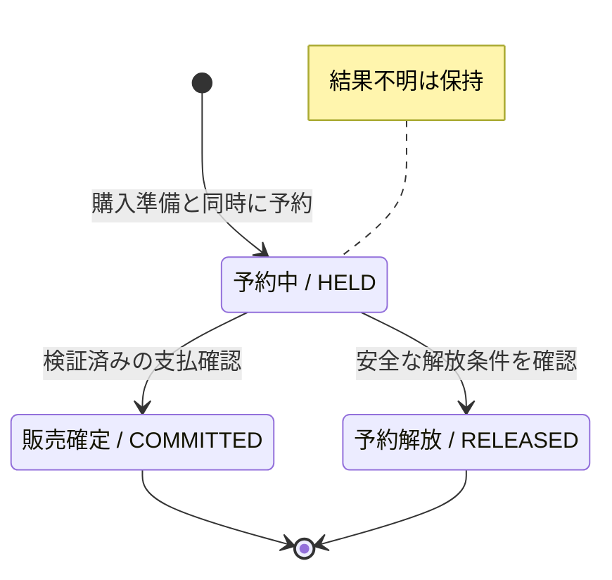
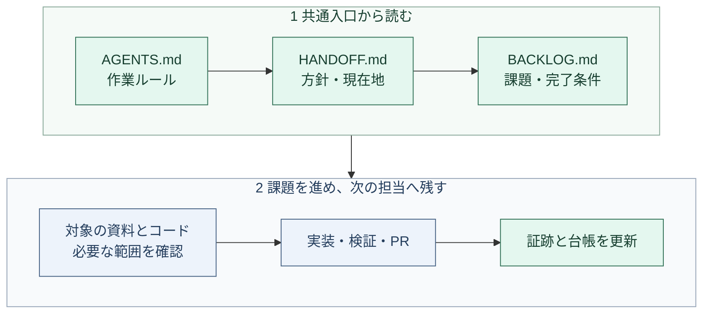
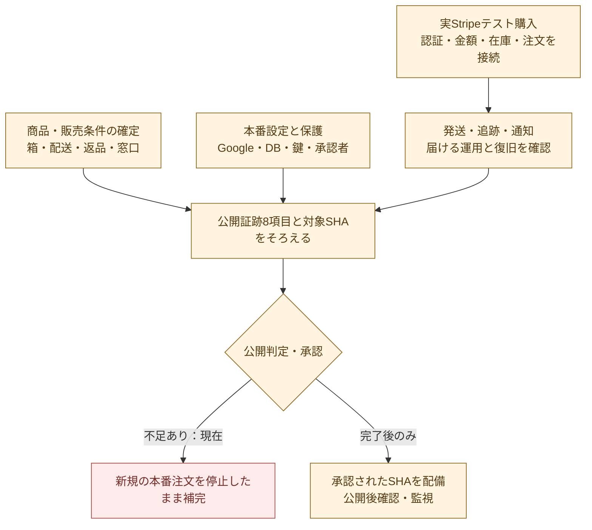

# BLOOM BOX

**花を選び、言葉を添え、受け取る体験までつなぐギフトプラットフォーム。**

Next.jsの画面と、PostgreSQLを中心とした自作の顧客・商品・注文・在庫管理を、ひとつのアプリケーションにまとめています。顧客はGoogleで直接認証し、決済は既存のStripe Checkoutへ接続する方針です。

> **現在は販売準備中です。** 新規の本番注文はコードと公開判定で停止しています。以下では、実装済みの処理・部分的な接続確認・これから完成させる運用を区別します。最新の状態は [残課題台帳](docs/operations/BACKLOG.md) が正本です。

開発に参加するAI・人は、まず [AGENTS.md](AGENTS.md) → [HANDOFF.md](docs/operations/HANDOFF.md) → [BACKLOG.md](docs/operations/BACKLOG.md) を確認してください。

[贈る体験](#贈る体験) · [現在地](#現在地) · [システム全体](#システム全体) · [コードの構造](#コードの構造) · [購入の流れ](#購入の流れ) · [在庫と復旧](#在庫と復旧) · [開発を始める](#開発を始める) · [本番公開まで](#本番公開まで)

## 贈る体験

利用者は花を選び、宛名・お届け希望日・メッセージを設定します。新しいギフトには日本時間の今日＋3日と「いつもありがとう」を入れ、編集内容はサイズ変更やカートへの復帰でも保持します。



緑は画面・内部処理を実装済み、黄と点線は実接続または運用が残る部分です。緑の部分も、それだけで本番稼働を意味しません。

<table>
  <tr>
    <th>BLOOM BOX M</th>
    <th>BLOOM BOX L</th>
  </tr>
  <tr>
    <td align="center"></td>
    <td align="center"></td>
  </tr>
  <tr>
    <td align="center">商品4,000円＋送料1,000円<br/><strong>合計5,000円</strong></td>
    <td align="center">商品8,000円＋送料0円<br/><strong>合計8,000円</strong></td>
  </tr>
</table>

ユーザー確認済みの初期条件は、税込・日本全国配送・1回1箱です。画像はパッケージのデザイン案で、箱寸法・花材・本数・内容量は未確定。実物と配送品質の確認は販売前の残課題です。

## 現在地

| 領域 | 確認できていること | まだ確認していないこと |
| --- | --- | --- |
| 顧客Google認証 | 実Googleの2顧客でログインし、架空注文の本人表示・相互非表示を確認 | 実Stripe購入からの紐付け、本番HTTPS |
| 顧客管理 | 専用権限で一覧・ID/注文番号検索・購入履歴・参照記録を実装、隔離DBで検証 | 氏名/連絡先・対応メモ、実Google/本番接続・運用承認。[導入手順](docs/operations/CUSTOMER_MANAGEMENT.md) |
| 商品・在庫管理 | 実Google＋隔離DBで登録・編集・補充・訂正・競合・権限失効を確認 | 正式な商品画像・実在庫・本番設定 |
| 注文・送料・在庫 | 購入者紐付け、購入時の価格・送料固定、予約・確定・安全な解放を内部実装・DB検証 | 実Stripeの最終金額、通信断後の実運用、発送・返品 |
| 画面 | M/L、カート編集、入力復旧、スマホの横ずれ抑制、メニュー・フォーカス等を確認 | 実機Safari、商用状態の読み上げ・購入E2E |
| 会員ランク・自動割引 | 本人の全購入実績・現在ランク・進捗、購入時割引の保存、Stripe金額照合を実装 | 料率は0/2/3/5%の先行案。採算・条件確定と実決済検証。[設計・検証](docs/operations/CUSTOMER_LOYALTY.md) |
| 紹介特典 | Test Modeで紹介・値引き・配達後付与・返金時取消を試せる | 本番の顧客・永続台帳・割引・正式イベントとの接続 |

通常のPreview購入で実決済は発生しません。ただし、Google認証や商品管理を隔離DBへつなぐ検証ではデータを保存します。**Preview表示、CI成功、架空の「支払済み」は、実決済・本番公開の証拠ではありません。**

検証の詳細：[顧客2名の表示分離](docs/operations/CUSTOMER_ORDER_ISOLATION_VERIFICATION.md) · [商品管理の実接続](docs/operations/NATIVE_CATALOG_CONNECTION_VERIFICATION.md) · [画面の検証記録](docs/design/VERIFICATION.md)

## システム全体

BLOOM BOXが顧客・商品・価格・在庫・注文・発送の記録を所有し、Googleは本人確認、Stripeは支払・返金の事実を提供します。顧客ログインと運営者ログインは、クライアント・秘密値・Cookie・権限を分離しています。



現行方針は [ADR 0009](docs/architecture/adr/0009-native-commerce-and-google-customers.md) です。Shopifyのアダプターは移行前の処理として残っています。新しい顧客認証や商品管理をShopifyへ戻す根拠にはせず、既存取引のデータも無条件に削除しません。

## コードの構造

業務モジュールを同じアプリケーション内に置く **Modular Monolith** です。下図の矢印は実行順ではなく、コードが依存する方向を示します。



DomainはReact・Next.js・DB・外部SDKを読み込みません。他モジュールへのアクセスは `public.ts` を通し、別モジュールのテーブルを直接更新しません。

| モジュール | 担当 |
| --- | --- |
| `catalog` | 商品、価格、送料、公開状態、商品管理 |
| `customer` | 顧客ID、Googleとの対応、購入者との紐付け |
| `checkout` | 購入準備、入力・所有権確認、購入時金額、決済への引継ぎ |
| `inventory` | 販売用在庫、予約、確定、解放、数量変更履歴 |
| `payment` | 署名検証、通知受付、支払・返金・紛争、再照合 |
| `order` | 注文、明細、購入時スナップショット、本人向け参照 |
| `fulfillment` | 配送日・住所と発送系の処理。旧Shopify経路の移行が残る |
| `referral` | Test Mode専用の紹介・特典ルール |

注文・支払・発送は別の状態です。購入者と受取人も別の主体として扱います。AI・分析・推薦を購入の必須処理へ入れず、その障害で注文を止めません。

```text
src/
├── app/                        ページ・ルート・共通CSS
├── ui/                         共有UI
├── modules/                    業務モジュール
│   └── <module>/
│       ├── domain/             業務ルール・状態
│       ├── application/        ユースケース
│       ├── infrastructure/     DB・外部サービス
│       ├── presentation/       画面への変換・入出力
│       └── public.ts           モジュール外への契約
└── shared/infrastructure/      構成・設定・認証・DB接続
content/                        編集可能な文言・プレビュー商品
config/                         公開承認などの設定
public/images/products/         M/Lのパッケージ案
database/                      DBマイグレーション・ロール
docs/                          設計・運用・検証・引き継ぎ
```

モジュール内のフォルダーは責務が必要な場合に置きます。一覧を埋めるための空実装は追加しません。詳細は [ARCHITECTURE.md](docs/architecture/ARCHITECTURE.md) を参照してください。

## 購入の流れ

以下は**実装済みの購入・決済処理の説明**です。本番の受付は停止しており、この全経路を実Stripeで通した証跡はまだありません。



価格・送料・数量・顧客の所有権をブラウザーの申告だけで確定しません。購入時の値を保存し、商品編集後の再送でも同じ購入の金額を変えません。外部通信中にDBトランザクションを長時間保持せず、通知の遅延・重複・順序逆転を想定します。

接続と検証：[Stripe](docs/operations/STRIPE.md) · [購入者紐付け](docs/operations/PURCHASE_CUSTOMER_BINDING.md) · [送料・金額照合](docs/operations/PURCHASE_SHIPPING.md)

## 在庫と復旧

予約は、確定か解放のどちらかへ一度だけ進みます。通信断でStripe側の結果が分からないときは、販売可能な在庫へ勝手に戻しません。



解放できるのは、決済先を固定する前の取消・期限切れ、または対応するStripeの期限切れ・支払失敗通知を検証できた場合です。

| 状況 | 守ること |
| --- | --- |
| 送信前に設定不備が判明 | 決済先を固定する前に拒否し、同じ購入の再試行・安全な取消を可能にする |
| Stripe作成後の通信断 | 同一キーの再試行や事業者との照合へつなぎ、結果不明の予約を保持する |
| 重複した通知・再送 | 注文、支払、在庫を重複確定しない |
| 支払後に期限切れ通知が届く | 確定済みの在庫を戻さない |
| 返金・返品 | 返金だけで再販売可能と決めない。返品・発送の運用と照合する |

発送時に在庫をもう一度減らしません。内部の安全な取消処理を顧客向け操作へつなぐことや、実Stripeでの期限後復旧は残課題です。数量の定義と適用手順は [NATIVE_INVENTORY.md](docs/operations/NATIVE_INVENTORY.md) にあります。

## 開発を始める

AI・人を問わず、チャット履歴の代わりにプロジェクト内の共通入口を使います。



[AGENTS.md](AGENTS.md) → [HANDOFF.md](docs/operations/HANDOFF.md) → [BACKLOG.md](docs/operations/BACKLOG.md) の順に確認します。課題の状態は台帳へ集約し、変わり得るPR・設定・URLは作業時に確認し直します。PRのタイトル・本文・レビューコメントは日本語です。

### ローカル起動

検証基準は **Node.js 24 / pnpm 10.23.0**。TypeScriptは既存の境界検査との互換性のため5.9系を使用しています。

```bash
pnpm install --frozen-lockfile
pnpm dev
```

ポートが使用中なら、利用中のサーバーを停止する前に作業ディレクトリを確認します。別ポートで起動する場合：

```bash
pnpm dev --port 3012
```

通常の起動はPreviewです。Google認証・商品管理DB・外部決済の接続には、それぞれの運用資料に沿った別設定が必要です。ローカル表示だけで本番設定が完了したとは扱いません。

### 検証コマンド

| コマンド | 確認するもの |
| --- | --- |
| `pnpm check:ci` | 静的方針、型、Lint、通常テスト、本番用ビルド |
| `pnpm test:database` | 専用の `TEST_DATABASE_URL` に対するDB試験。隔離したテストDBで実行 |
| `pnpm check:production` | 案内・公開承認・本番構成の判定。現在は承認不足で失敗する状態が正しい |
| `pnpm check:release` | 本番候補向けの全体検査・本番依存監査・公開判定 |

DB専用試験は環境未設定なら通常テストでスキップされるため、通常テスト成功と区別します。GitHub CIには専用PostgreSQLでの試験があります。変更の深さに応じた確認範囲は [DEVELOPMENT.md](docs/engineering/DEVELOPMENT.md) を参照してください。

### 変更する場所

| 変更したいこと | 入口 |
| --- | --- |
| サイト文言・プレビュー商品 | `content/` と対応するZodスキーマ |
| 色・余白・共通の見た目 | `src/app/globals.css` と [DESIGN_SYSTEM.md](docs/design/DESIGN_SYSTEM.md) |
| 価格・配送日・状態遷移 | 担当モジュールのDomainと関連テスト |
| DB・外部サービスの接続 | Infrastructure、検証済み設定、composition-root |
| 次の課題と進捗 | [BACKLOG.md](docs/operations/BACKLOG.md) |

## 本番公開まで

実装・事業判断・外部設定・検証をそろえてから公開します。以下は実施順の概要で、現在の本番稼働を示す図ではありません。



必要な証跡は、①有効化判断、②自作カタログ、③StripeテストE2E、④在庫、⑤税・送料、⑥個人情報・サポート、⑦正式な案内の承認、⑧バックアップ・切り戻し・障害演習です。承認値だけを書き換えて公開判定を通すことはしません。

| 資料 | 用途 |
| --- | --- |
| [HANDOFF.md](docs/operations/HANDOFF.md) | 参加直後に読む短い引き継ぎ |
| [BACKLOG.md](docs/operations/BACKLOG.md) | 残課題・優先順位・完了条件・確認日の正本 |
| [ARCHITECTURE.md](docs/architecture/ARCHITECTURE.md) | モジュール・依存方向・状態・責任の境界 |
| [ADR 0009](docs/architecture/adr/0009-native-commerce-and-google-customers.md) | 自作CommerceとGoogle直接認証を選んだ理由 |
| [AUTH_ROUTING.md](docs/operations/AUTH_ROUTING.md) | トップから顧客・管理者ログインへの経路と接続設定 |
| [GOVERNANCE.md](docs/operations/GOVERNANCE.md) | レビュー・権限・環境の保護 |
| [RELEASE.md](docs/operations/RELEASE.md) | 本番候補の検査・承認・配備・復旧 |

確認済みの状態は2026-09-14の引き継ぎに基づきます。最新の完了・未完了は台帳と対象コード、実際の設定・検証記録を参照してください。
