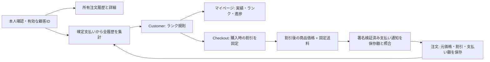

# ADR 0013: 購入実績に基づく会員ランクと自動割引

- 状態: 実装方針を採用。料率・閾値は初期案であり、販売開始前に採算と顧客向け条件を確定する
- 日付: 2026-09-14
- 深度: L3（顧客別集計、価格、決済照合、保存形式）

## 背景と参考調査

ユーザーは「ランク別の自動割引」を選択。贈答は購入間隔が長いため、継続契約や毎月の購入を条件にしない。既存の本人所有注文履歴・注文詳細を再利用する。

| 公式資料（2026-09-14確認） | 参考にする点 | BLOOM BOXでの判断 |
| --- | --- | --- |
| [ナッシュのマイページガイド](https://nosh.jp/use/mypage)・[nosh club規約](https://nosh.jp/club/agreement) | 注文履歴とMyランク、購入実績が次回以降の割引になる | 履歴とランク・次の特典までの進捗を同じページに配置 |
| [BASE FOOD マイル制度ヘルプ](https://basefood.zendesk.com/hc/ja/articles/900001979383) | ランク用の累計マイルと交換用の保有マイルを区別。購入キャンセル時の調整も定義 | 交換式ポイントを導入せず、商品購入実績に一本化 |

公開ヘルプと規約の調査であり、他社顧客としてログイン後の画面を閲覧したものではない。ナッシュの停止時の扱いには規約上の条件がある。BASE FOODの継続コース条件や旧制度をBLOOM BOXへそのまま適用しない。

## 決定

| ランク | 累計の商品購入実績（税込） | 次回の商品割引 |
| --- | ---: | ---: |
| SEED | 0円 | 0% |
| SPROUT | 12,000円 | 2% |
| BLOOM | 30,000円 | 3% |
| BOUQUET | 60,000円 | 5% |

唯一の規則はCustomerの純粋なTypeScriptポリシーに置く。料率はbasis points（整数）、割引額は1円未満切り捨て。金額は安全な整数の範囲を検証する。バージョン付きの購入時点の規則を保持し、後から旧規則を上書きしない。

実績は本人のSTRIPE注文（CONFIRMED/CLOSED）のうち、JPYの全額売上確定を確認できる支払い1件から集計する。対象額は `max(0, 商品小計 - 商品割引 - 確定返金額)`。送料・未払い・全額返金・キャンセル・異議申立て・複数支払い・Shopify旧注文・未紐付け注文は対象外。返金配賦情報がない間は商品から先に控除する保守的な規則とする。送料返金だけでも実績が減る点を顧客向け条件で明示する。保留中・失敗した返金は控除しない。返金・キャンセル・異議申立てで将来ランクが下がることがある。有効期限は設けない。

Orderの読み取りアダプターが所有者と支払いを一つのSQL文で集計し、Customerがランクに変換する。ページング後の10件から集計しない。残高台帳を別途増減させないため、Webhook重複・再処理で加算が重複しない。再計算可能な注文・支払いデータが根拠。独立したキャッシュやジョブは現時点では作らない。顧客/注文/支払いの既存索引を使い、成長時は実測後に集計投影を検討する。

Checkoutはサーバーで取得した顧客IDと実績だけを使用する。ネイティブ商品・1箱・確定送料・税込の決済に限定する。匿名とプレビュー商品には適用しない。クライアント指定の金額・ランク・割引率を受け取らない。購入IDの再試行では保存済みの見積もりが優先される。並行作成時も既存の一意制約と再読み込みにより勝者の価格を返す。見積もり取得後の返金や並行購入はその見積もりを変更せず、次の新規購入から反映する（既存の有効期限まで）。集計障害時に勝手に通常価格で決済しない。

Stripeには追加クーポンAPIを呼ばず、割引後の単価を送信する。Stripe上の別建て割引額は0で、内部には元の商品価格と会員割引を残す。Webhookで割引後小計・送料・合計を照合し、不一致やクーポン併用を拒否する。既存の価格/税額照合は緩めない。過去のNULLスナップショットは会員割引なしとして扱い、既存取引の精算を維持する。

## 選択肢とトレードオフ

- ポイント財布: 交換・失効・予約・二重使用の管理が必要。ユーザーの選択に従い見送る。
- 都度集計（採用）: 誤った重複加算や投影遅延がない。一方、購入数増加時に読取コストを測る必要がある。
- Stripeクーポン: 見栄えの良い別建て表示ができるが、外部資源の作成/再試行/適用範囲が増える。現在の1箱・税込価格に対しては割引後単価で十分。

## セキュリティ・運用・検証

認証はGoogle subjectと永続顧客ID。メールで他人の注文を統合しない。無効アカウントの実績を返さない。recipientは実績所有者にならない。PII・実績をURL/公開キャッシュ/ログに記録しない。顧客画面は既存の動的・非公開レスポンスを維持する。

0025 migrationは既存行を変更せずNULLの割引スナップショットを追加し、更新をDBトリガーで禁止。アプリ権限を増やさない。戻す場合もmigrationを削除せず、特典作成の配線を停止し、既存割引取引を処理できるworkerを残す。旧workerへ戻すと割引決済の照合に失敗するため、割引済み取引が残る間は互換workerが必須。

必須証拠: ランク境界・端数・不正入力、所有者分離、ページに依存しない集計、返金/取消/異議申立て、権限・DB障害、スナップショット復元/改変拒否、再試行・並行実行、Stripe金額照合と重複通知、狭幅/広幅UI。実Google2人・実Stripeテストと本番確認は別のリリース証拠。

## 公開前の作業

既存の本番受付停止を維持する。採算（原価/送料/決済手数料/返金）、料率・閾値と顧客向け条件、旧注文移行の扱い、実Google/Stripeでの割引決済・返金・再計算、会計での割引後税額を確認してから販売を開始する。一般的な期限降格・ポイント交換・自動メールは追加しない。
