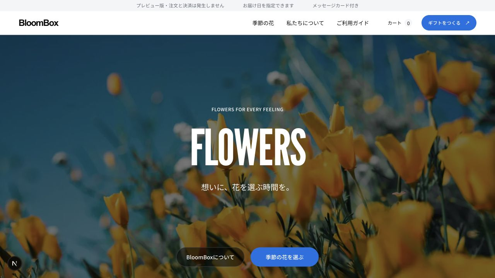
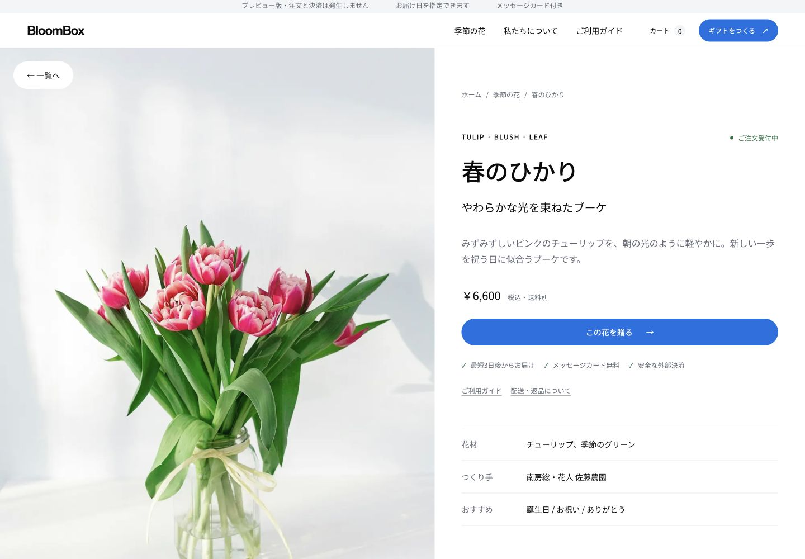
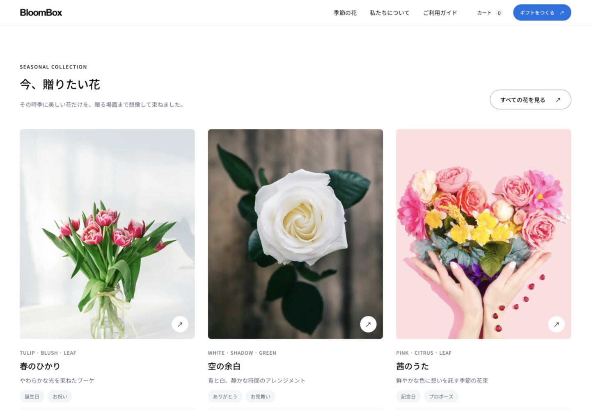
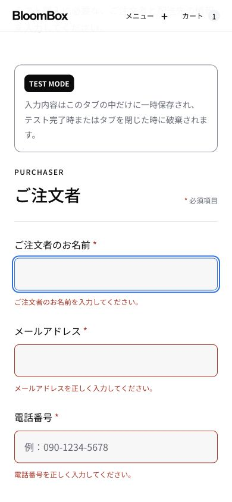

# Design system — verification

## ヒーローのブランド書体統一 — 2026-09-12

ヒーローのBloomBoxをヘッダーロゴと同じArial・太字700・字間−0.07emに変更。ヒーローの表示サイズは維持し、モバイルは`clamp(64px, 20vw, 145px)`で幅に応じて調整する。不要になったLeague Gothicの読み込みを削除した。

- `pnpm check:design`、`pnpm typecheck`、`pnpm lint`、`pnpm build`、`git diff --check`成功。型チェック初回は古い`.next`のルート型で失敗したため、`pnpm exec next typegen`で再生成してから確認。
- Chromeの`localhost:3000`でデスクトップのヒーローとヘッダーを目視比較し、同じ字体・太さ・字間の比率と、ヒーローの1行表示を確認。
- モバイルの実画面・横スクロール確認はブラウザー操作エラーにより未完了。今回のスクリーンショットはリポジトリに保存していない。以下の旧画像は変更前の履歴。
- 追加依存・環境変数・DB変更なし。ロールバックは書体変更コミットのrevert。

## v2.1 アクセントカラー更新 — 2026-09-11

ユーザーの「ロスフラワーとフレッシュさを表現するカラー」という指定により、主操作・現在位置・フォーカスをフレッシュグリーンへ変更。変更レベルはL1。CSSの `--accent`（#16804A）と `--accent-hover`（#10663B）のみを変更し、全画面で共有する。成功・エラーの意味色と購入処理は変更していない。

- sRGB相対輝度から計算した白とのコントラスト：通常4.98:1、hover 7.03:1。通常色と補助面は4.56:1、入力面は4.64:1。
- ローカルで `pnpm check:ci` 成功：型・lint・デザイン規約・境界検査、245件のテスト、本番ビルド。既存DB7件はローカル設定なしでskip。
- 開発サーバーで1280pxのホームと390pxのギフト入力を目視確認。モバイルの入力欄・主操作の収まりを目視確認。今回のブラウザ内の寸法取得はタイムアウトしたため、幅の数値一致は再確認していない。
- Tabで主ボタンへ移動し、白文字、フレッシュグリーンの背景と2pxのフォーカス輪郭を確認。hoverはトークンと既存CSSルール、コントラスト計算を確認。実ポインターのhover・スクリーンリーダーの再試験は行っていない。
- 最新の配色証跡：[ホーム](evidence/accent-home-desktop.jpg)、[ギフト入力とフォーカス](evidence/accent-gift-mobile.jpg)。以下のv2.0画像は以前の青い配色を記録した履歴であり、現行配色の見本ではない。
- 戻す場合はこの配色変更のコミットをrevertし、CSSとガイドを合わせて戻す。追加依存・環境変数・DB変更なし。

## v2.0 初期デザイン検証（履歴）

確認日：2026-09-11。対象は`codex/minimal-design-system`。表示変更はL1、フォームは入力エラーのARIA属性・フォーカスのみを変更。価格計算、購入条件、セッション保存形式、決済処理は変更していない。

## 自動確認

- `pnpm check:ci`：成功。repository / architecture / database migration ordering / design / hardcoding / TypeScript / ESLint / 全テスト / 本番ビルド。
- テスト：35ファイル・136件成功。接続先を必要とするDB統合テスト1ファイル・7件は既存の条件によりskip。DBマイグレーションは変更なし。
- `check:design`を一時ディレクトリのCSSで追加確認：正常なCSSは成功、コンポーネント内の色直書きと未定義トークン参照はそれぞれ失敗。
- `git diff --check`：成功。

## 実画面・操作確認

本番ビルドをローカルの別ポートで起動し、プレビューモードで検証。ホームの最終キャプチャは同じソースの開発サーバーで取得（左下の小アイコンはNext.js開発ツール）。既存の開発サーバーとは別originの検証専用セッションを利用した。氏名・メール・電話・住所はすべて動作確認用の架空データ。

| 対象 | 確認内容 | 結果 |
| --- | --- | --- |
| ホーム | 全面写真、表示書体、章の整列、商品情報が写真の外にあること | 確認 |
| 1440px | 商品詳細の2カラム、商品価格・購入ボタン、横overflow | overflowなし |
| 390px | ホーム、一覧、ギフト、配送先フォームの縦積み | overflowなし、入力16px、入力高48px以上 |
| 768px | 注文確認の本文とサマリーの縦積み、完了画面 | overflowなし |
| 320px | FAQの長い日本語、ヘッダー、開いた回答 | overflowなし |
| メニュー | キーボード開閉、Escapeでトリガーへ復帰、リンク選択で閉じる | 確認 |
| 一覧 | 検索0件の説明、条件クリアで商品に復帰 | 確認 |
| ギフト入力 | 空送信、エラー文、`aria-invalid`、最初の名前欄へのfocus | 確認 |
| 配送先入力 | 空送信、7項目の`aria-invalid`、最初の注文者名欄へのfocus | 確認 |
| 購入フロー | ギフト→カート→配送先→確認→ダミー決済失敗→成功→完了 | 確認 |
| 完了後 | カートが空へ戻り、個人情報削除の案内が表示される | 確認 |
| FAQ | Enterで回答を開く | 確認 |

最終スタイルの共通フォーカス、操作サイズ、文章の折返しを実画面で確認した。網羅的なスクリーンリーダー監査や全端末の保証ではない。reduced-motionはCSS分岐を確認し、OS設定を変更する検証は行っていない。

## 画面証跡

| ホーム：デスクトップ | 商品詳細：デスクトップ |
| --- | --- |
|  |  |

| 商品カード：デスクトップ | 入力エラー：モバイル |
| --- | --- |
|  |  |

## 制約と戻し方

- Manuka Condensedは未提供の商用書体のため、資料指定の代替候補League Gothicを使用。元サイトの字形・ブランド素材とのピクセル単位の一致は対象外。レイアウトとトークンの対応は[デザインガイド](DESIGN_SYSTEM.md)に記録。
- 写真は既存の外部画像を利用。プレビュー表示、配送条件、同意、エラーを維持した。
- 新しい環境変数・DB変更・追加npm依存なし。フォントはNext.jsで同一サイトから配信。
- 本番候補ではないため`check:release`は未実行。本番のプロバイダー準備条件は変更していない。
- ロールバックはこのPRをrevertする。コンテンツとZodスキーマ、CSSとフォント定義を必ず一緒に戻す。DB・外部決済への復旧操作は不要。
