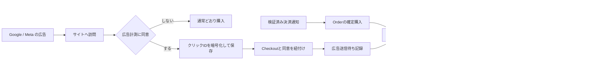

# 広告連携

2026-09-14。実装済みの接続基盤。実アカウントへの送信・広告出稿は未実施。

## 実装済みの範囲

- Google広告: Data Manager API `events:ingest`。gclid優先、なければgbraid、wbraidを使用。OAuthは顧客Googleログインと別。
- Meta広告: Conversions APIのPurchase。fbclidからfbcを生成。メール/電話の高度なマッチングや顧客リスト送信は行わない。
- その他: HMAC-SHA256署名付きWebhook。受信側は署名・時刻（5分程度）を検証し、eventIdを永続的に重複排除する。レスポンス契約はJSON `{"accepted":true}`。任意の広告媒体には専用アダプターの追加が必要。
- 30日同意、拒否、撤回、初回広告クリックの暗号化保存、送信待ち記録、重複対策、排他的worker、再試行、保存期限掃除。
- 購入イベントのみ。PageView/ViewContent/AddToCart、リターゲティング、GA4、商品フィード、広告予算・キャンペーン作成、返金訂正、広告ダッシュボードは対象外。

## 設定

秘密情報はサーバー環境変数だけに登録し、GitやNEXT_PUBLIC変数に入れない。

| 変数 | 内容 |
|---|---|
| BLOOMBOX_ADVERTISING_ENABLED | 初期値false。trueで同意画面を表示 |
| BLOOMBOX_RUNTIME_MODE | previewでは外部送信とDBへのクリック保存を停止。productionだけ実送信 |
| BLOOMBOX_PUBLIC_ORIGIN | 実サイトのHTTPS origin。localhostはpreview限定 |
| AD_GOOGLE_CUSTOMER_ID | コンバージョンを所有するGoogle広告アカウントID、ハイフンなし10桁 |
| AD_GOOGLE_CONVERSION_ACTION_ID | Google側で作成する購入コンバージョンID |
| AD_GOOGLE_CLIENT_ID / AD_GOOGLE_CLIENT_SECRET / AD_GOOGLE_REFRESH_TOKEN | Data Manager権限を持つ別OAuthクライアント/refresh token。scopeは `https://www.googleapis.com/auth/datamanager` |
| AD_META_PIXEL_ID / AD_META_ACCESS_TOKEN / AD_META_API_VERSION | データセット（Pixel）ID、CAPI権限のトークン、アカウントで利用可能な明示バージョン（例v24.0）。バージョン失効前に更新 |
| AD_WEBHOOK_URL / AD_WEBHOOK_SECRET | 管理下のHTTPS受信先、32文字以上の署名鍵。任意のURLを利用者から受け取らない |
| BLOOMBOX_PII_KEYRING | 既存の暗号鍵リング形式。期限まで旧復号鍵を保持 |
| DATABASE_URL / DATABASE_WORKER_URL | 通常アプリ/worker接続。0026適用後にroles.sqlの広告テーブル権限を付与 |
| COMMERCE_WORKER_SECRET | 既存形式のworker認証secret |

有効にする媒体だけ、その媒体の設定一式を登録する。設定が部分的なら無効として検出。広告設定エラーはサイトを停止せず、匿名化したobservabilityイベントを出す。公開顧客認証専用DBロールへの権限追加や、現在の公開プレビューでの計測有効化は行っていない。

## 定期処理と監視

認証ヘッダー `Authorization: Bearer <COMMERCE_WORKER_SECRET>` 付きPOSTを `/api/internal/advertising-delivery` へ5分ごとに実行するスケジューラーを設定する。1回最大5件、最大60秒。Vercel CronのGETとは異なるため、認証POST対応の既存ジョブ実行基盤から呼び出す。今回はスケジュールを作成しない。

送信と別に、同じ認証のPOST `/api/internal/advertising-delivery?mode=retention` を毎日実行する。広告を無効化した後もこの掃除は継続する。クリック情報は同意撤回時に消去、期限切れ時はworkerが消去する。送信待ち/受理記録は90日保持。保持期限は処理実行に依存するので、worker停止を監視する。

送信先の応答待ちは4秒（GoogleはOAuth+送信で最大8秒）、応答32KB、リダイレクト禁止。DBは接続障害時に既存接続上限を適用する。購入時のAdvertising保存失敗は注文を失敗にせず `advertising_bind_checkout` として記録する。その場合の広告計測欠落を監視する。

運用時は `status='failed'` と `status='pending'/'sending'` の期限超過を監視する。5回/47時間で自動再送を打ち切る。`accepted` はAPI受理であって帰属成功ではない。Googleのreceipt（requestId）はrequestStatusで処理結果を確認し、Meta Events Managerで受理/一致/重複を検証する。レスポンス本文やクリック情報をログにコピーしない。

## 本番接続前の検証

1. migration 0026とDB権限、暗号鍵、origin、所有広告アカウントと変換先を確認する。Cookie設定APIには既存WAFで送信頻度制限を設定する。
2. GoogleのData Manager APIとOAuth権限を有効化し、対象コンバージョンで受信を確認する。新規連携で旧Google Ads APIのoffline uploadを前提にしない。
3. Metaの権限/利用バージョンを確認し、対象データセットにテストイベントを送って仕様を照合する。現在のアダプターはliveのPurchase送信用で、テストモード自動切替は実装していない。
4. 同意なしでクリック保存・送信ゼロ、撤回後に未送信が停止、ブラウザを閉じてもworkerが確定注文を処理、再試行が重複購入にならないことを実アカウントで検証する。
5. 販売開始ゲートを満たした後に有効化。広告APIへの接続は有料キャンペーン作成の許可を意味しない。

## 制約

- 最初に同意した広告クリックへの対応を保存する。複数媒体/接点を横断する高度な帰属モデルではない。
- cookieを消した/別ブラウザで購入した/同意前に広告ページを離れた場合は紐付かない。URLにないクリックIDを推測・生成しない。
- 同意時刻より前の購入や47時間を超えた購入、テスト決済、未払い、送信前に返金/取消された注文は送らない。
- 送信後の返金・取消は自動訂正しない。媒体の報告と売上台帳を同一視せず、返金控除後のROASは注文側の確定値で評価する。返金訂正アダプターは次の拡張候補。
- 同意撤回とすでに外部送信中の通信を原子的に取り消すことはできない。すでに送った情報の削除は別途データ主体対応が必要。
- Google/Metaの実権限・到達/帰属テストは未確認。ローカル検証で成功を代替しない。

## 公式仕様

- [Google Data Manager: イベント送信](https://developers.google.com/data-manager/api/devguides/events/send-events)
- [Google events.ingestとAdIdentifiers](https://developers.google.com/data-manager/api/reference/rest/v1/events/ingest)
- [Googleの同意状態](https://developers.google.com/data-manager/api/reference/rest/v1/Consent)
- [Google Ads APIの未バージョン化変更](https://developers.google.com/google-ads/api/docs/deprecations)
- [Meta Conversions API](https://developers.facebook.com/docs/marketing-api/conversions-api/)
- [Meta公式のConversions APIタグ実装](https://github.com/facebookincubator/ConversionsAPI-Tag-for-GoogleTagManager)

## 実装検証（2026-09-14）

- `pnpm check:ci`：型・lint・architecture・content/design検査、1,035件の通常テスト、build成功。
- 隔離したローカルPostgreSQLでmigrationを二度適用し、広告DBテスト7件成功。重複binding、同時claim、lease再取得・古いworkerの拒否、暗号化/期限/撤回、アプリ/worker権限、確定ライブ注文の読み取り、購入開始後の広告クリックの除外を確認。
- APIテストでOrigin・入力サイズ・JSON・不明フィールド・worker認証・初期無効化を検証。撤回とバックグラウンド通信の競合で勝手に再同意しないことを検証。
- Google/Meta/WebhookのHTTP境界はモックで契約、秘匿、失敗応答、再送IDを確認。実媒体送信の証明ではない。
- Chromeの320px/1440pxで横はみ出しなし、操作領域48px。UIプレビューで拒否→再設定→同意→再読込時の保持を確認。実機Safariとスクリーンリーダー実操作は未確認。
