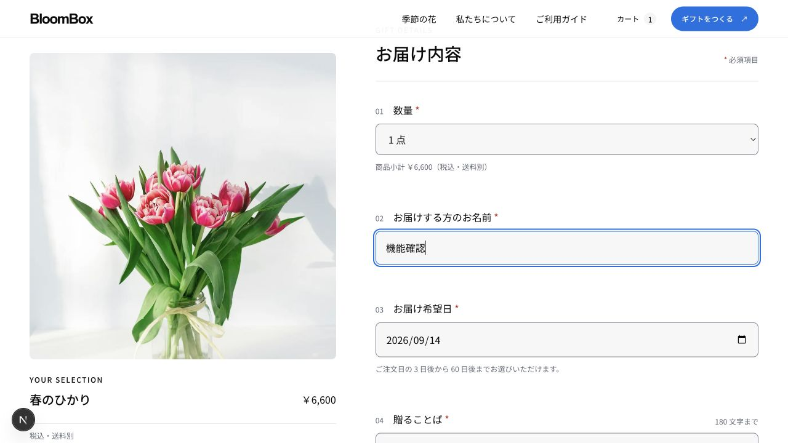

# カート編集と購入再開

2026-09-11。単一商品・単一配送先という現行仕様のまま、カートの編集と日付修正による再開を実装した。

## 発見した不足と実装

| 不足 | 変更後 |
| --- | --- |
| 「内容を変更する」で空のフォームになる | 数量、受取人名、お届け日、メッセージを復元。保存するまで元のカートを変更しない |
| 日が変わり配送リードタイムを満たさなくなるとカートが空に見える | 構造が妥当な下書きを表示し、日付の変更へ誘導。購入開始は無効。決済側の有効日付検証は維持 |
| 別の花を追加すると以前のギフトを無言で置換する | 入れ替えを明示的に選択するまで追加不可。別商品の受取人情報はフォームへコピーしない |
| 購入準備後の編集で古い操作IDを使う恐れ | 保存ごとに新しいUUIDを生成。カートから購入開始を再試行する間は同じ保存済みIDを利用 |
| 編集後に古い金額・同意を利用する恐れ | 商品編集で古い購入準備・確認同意・receiptを破棄。購入者／住所編集でも同意を破棄 |
| 編集中に別の操作でカートが変わると上書きする | 編集開始時のrequestIdと保存時の値を比較。不一致なら更新せずカートへの復帰を案内 |
| 売切れ商品のギフトURLへ直接入れる | サーバーで販売可能かを確認し、入力フォームの代わりに他の商品・カートへの導線を表示 |

## 保存・プライバシー・障害時の扱い

`readRecoverableCart`は表示・編集専用。ISO暦日、数量、名前、メッセージ等の構造検証を保持し、配送可能範囲だけを再入力可能にする。`readCart`、新規保存、Server Action、Applicationの購入開始は有効な配送日のみを受け付ける。復元用の読み取りを決済の判定に使わない。

同じ商品・同じ受取人名で数量／メッセージ／日付を変更する場合は、同じタブの配送先入力を保持する。商品または受取人名を変えた場合は、以前の購入者・住所を破棄する。保存先は既存のsessionStorageのみ。新しいPII項目、外部送信、localStorageへの移行、保持期間の追加はない。タブを閉じる・削除する・テスト購入を完了する処理は既存のまま。

保存値を検証し、競合を確認した後、以前の確認同意を無効にしてからカートを書き込む。最後の書き込みが失敗した場合は旧カートを残し、購入準備からやり直す。古い内容の承認で変更後の金額を支払う状態を作らない。

ブラウザーの価格・在庫・名前は権威ある注文情報ではない。価格・在庫・配送日・操作IDの再検証は既存のサーバー処理が行う。新しいUUIDは認証・認可の代替ではない。

発行済みHosted Checkout Sessionや確定注文をこの編集操作で取り消すことはない。本番連携の取消・返金・在庫解放は別の課題として扱う。

## 検証

- `pnpm check:ci`成功。146テスト成功、既存DB統合テスト7件skip。型、lint、構成検査、本番ビルド成功。
- 回帰テスト：期限外下書きの復元と修正後の購入再開、不正な暦日・数量拒否、同じ受取人の住所保持、受取人／商品変更時の住所削除、古い金額・同意の無効化、古い編集の拒否、保存失敗で旧カートを維持。
- ブラウザー：ギフト2点を保存→購入準備→カートから編集→4項目の復元→3点・メッセージ更新→再び購入準備へ進めることを確認。商品小計は13,200円から19,800円へ変更。
- 保存せず戻ると、編集中のメッセージがカートへ反映されないことを確認。
- 別の商品のフォームで旧受取人情報が空であること、入れ替え確認前は送信不可、確認後に新しい商品・名前・メッセージへ置き換わることを確認。検証後はカートを削除。

日付経過はOSやブラウザーの時刻を変えず、固定時計の回帰テストで検証した。売切れ表示はサーバー条件分岐と既存の購入拒否テストで確認し、公開カタログをテストのために変更していない。

## 画面証跡

## 残る機能と戻し方

休業日・締切・地域制約、実在庫予約、Shopify Checkout、出荷・追跡更新、通知連携は未完了。[残課題台帳](BACKLOG.md)の前提条件と受入条件に従って進める。

戻す場合はこの機能PRをrevertする。DB・環境変数・外部サービスの変更はない。保存形式v1を維持しているためデータ移行は不要。ただし旧実装へ戻すと、期限外の日付を持つカートは再び空表示となる。

## Preview form save failures — 2026-09-12

Buyer information and review confirmation forms now catch storage failures during submission. They display a generic `role="alert"` message, retain the current form, and navigate only after saving succeeds. Retrying clears the previous message. Storage exception details and entered personal data are not logged or included in the error text. Existing storage formats, approval invalidation order and pricing are unchanged.

Verification: six submit-handler regression tests cover quota/security exceptions, successful retries, cleared error state and save-before-navigation ordering. Four failure cases reproduced uncaught exceptions before the change. `pnpm check:ci` passed (759 tests, 138 external/DB-dependent tests skipped). Local Chrome confirmed M gift → cart (JPY 5,000) → buyer form → review → dummy payment screen, with no horizontal overflow on the 320px review page. Fault injection is a unit-level check; browser storage settings were not changed. No real payment or Shopify checkout E2E was run.

Scope: this change covers writes during these two submit operations. Initial page-load storage denial is handled by the recovery state below; other cart/storage write operations remain separate work. Revert the form changes to roll back; there is no migration or environment change.

## Unreadable browser storage — 2026-09-12

The client revision reader catches both access-denied sessionStorage getters and getItem failures, returning a stable unavailable marker rather than an empty-cart snapshot. Gift, cart, buyer, review, dummy payment and receipt screens stop before reading their stored details and show one shared recovery message. The header shows an unknown count (—), not zero, when cart reading fails. Reload after correcting browser storage settings rechecks access; no storage clearing or writes are part of recovery.

Copy is centrally validated in content/gift-experience.json. No raw exception, token, address or gift message is included in recovery feedback. Existing storage v1 formats, price validation, payment decisions and provider behavior are unchanged. A later recovery screen can replace an in-progress form; this does not promise persistence of unsaved input. Mid-operation storage policy changes after a successful snapshot and other write failures are not covered by this initial-read guard.

Verification: 16 new tests cover property/getItem denial, all six recovery screens, stable snapshots, recovery on a subsequent read, no writes and unknown header count. Reverting only the UI guards reproduced 13 failing cases. Previous six submit-retry tests also pass. Full pnpm check:ci passed. A temporary static rendering of the real recovery component and shared CSS was inspected in Chrome at 320px: document width 320px, retry button height 48px. This visual fixture does not simulate browser storage denial or hydrate the retry button; behavioral coverage comes from unit tests. No actual browser privacy settings were changed and no real payment/Shopify E2E was performed.

Rollback: revert the recovery change. No migration or environment changes are required, and no customer data is rewritten.

## Cart removal failures — 2026-09-12

Cart removal now invalidates review acceptance first, removes buyer and draft state, and removes the cart last. If any removal fails, the cart remains available for another attempt. Subscribers are notified even after partial cleanup, so other checkout screens see the current state. Repeated cleanup is safe and previously stored receipts remain unchanged. There is no multi-key transaction: buyer/draft input can already be gone when a later step fails; if the first removal fails, all prior state remains unchanged.

The cart catches both sessionStorage property denial and removeItem exceptions, displays centrally validated, generic retry feedback with role="alert", and disables deletion while purchase preparation is pending. The message explicitly explains that some checkout input may have been removed. No raw exception or personal data is logged. Browser cleanup does not cancel provider checkout sessions or confirmed orders.

Verification: four storage fault cases reproduced failures before the fix. Eight added regression cases cover all four deletion positions, retry and repeated cleanup, approval invalidation, subscriber notification, unchanged receipt data, property denial, generic feedback and the pending guard. `pnpm check:ci` passed: 783 tests passed, 138 external/DB-dependent tests skipped; static checks and production build passed. Local Chrome confirmed M gift → JPY 5,000 cart → remove → empty cart and header count zero. Storage fault injection and pending behavior were verified in tests, not by changing real browser settings. The new error state has not been visually checked on mobile; no real payment or Shopify E2E was performed.

Rollback: revert this focused removal change. Storage v1, environment variables and database schemas are unchanged. Data already removed cannot be restored by rollback. The initial-read recovery change remains a prerequisite when these changes are reviewed as stacked PRs.
