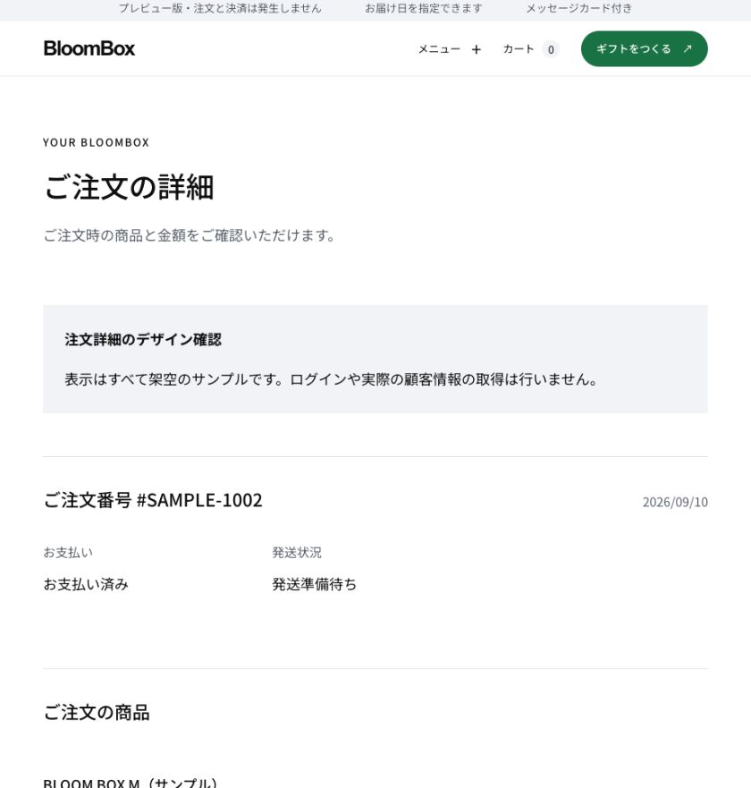
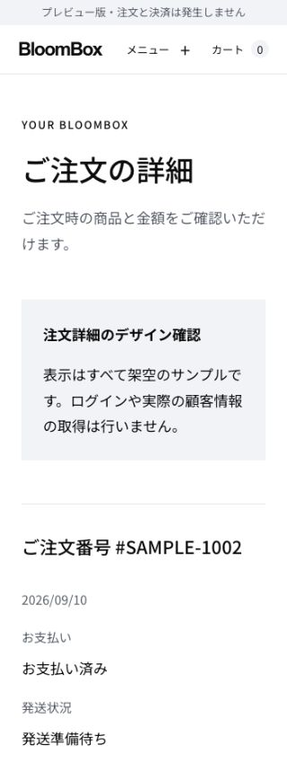

# Native customer account with Google login

2026-09-13. The user selected Shopify-independent commerce under [ADR 0009](../architecture/adr/0009-native-commerce-and-google-customers.md). `/account` now uses Google OIDC directly and native PostgreSQL customer/order records. Shopify Customer Account credentials and operator Google credentials are not accepted for this route.

## Implemented

- Google login returns to BloomBox `/account`; local logout ends only the BloomBox session.
- Verified issuer/subject maps to one durable customer ID, including concurrent first logins. Email is not an identity key and never claims existing orders. No recipient enrollment or marketing consent is inferred.
- Existing customer_accounts/customer_identities tables from migration 0001; no new migration. Registration and a redacted audit record commit atomically. Disabled/anonymized customers cannot log in; account version changes invalidate sessions.
- Name/email are verified-login snapshots stored only in an encrypted HttpOnly cookie for an absolute maximum of 15 minutes. No Google access, refresh or ID tokens are retained; session JSON returns only the internal customer ID and expiry.
- Native order summaries are read through Order's public contract, with an explicit buyer.customer_id ownership filter, newest first, 10 per page. Only native/Stripe-cohort orders appear. Unlinked, recipient-only and historical Shopify orders never become visible through email matching.
- Amount is the original order total; payment and fulfillment remain separate. Mixed/missing statuses show an unknown state. Profile editing, refund detail, order claiming and address books are not implemented.

## External setup

Create a customer-only Google Cloud project and Web OAuth client branded BLOOM BOX. Do not publish or repurpose the operator project's consent screen. The earlier draft Google client with Shopify callback URLs was never created and is obsolete.

Register exactly `https://<bloom-box-origin>/api/customer-auth/callback/google` in Google. For local development only, an exact `http://localhost:<port>/api/customer-auth/callback/google` is supported. Do not register Shopify callbacks. Keep the consent screen/testing audience isolated until privacy/support content and real-provider verification are complete.

Set server-side only in the isolated deployment:

| Setting | Requirement |
| --- | --- |
| CUSTOMER_ACCOUNT_ENABLED | true to enable controlled validation; absent/false otherwise |
| AUTH_URL | Fixed BloomBox origin; must match CUSTOMER_ACCOUNT_ORIGIN |
| CUSTOMER_ACCOUNT_ORIGIN | HTTPS origin, or HTTP localhost/127.0.0.1 outside production runtime |
| CUSTOMER_ACCOUNT_SECRET | Independent random secret, 32+ characters; cannot equal operator AUTH_SECRET |
| CUSTOMER_GOOGLE_CLIENT_ID | Customer Web OAuth client ID; cannot equal operator AUTH_GOOGLE_ID |
| CUSTOMER_GOOGLE_CLIENT_SECRET | Customer client secret; never stored in content/chat/repository |
| DATABASE_URL | Private PostgreSQL with existing migrations and application role permissions |
| DATABASE_SSL_MODE | verify-full for hosted deployments; disable only for isolated local DB |

NEXTAUTH_URL and AUTH_REDIRECT_PROXY_URL overrides are rejected. Old CUSTOMER_ACCOUNT_CLIENT_ID/CLIENT_SECRET/SHOP_ID values cannot enable Google login. The new cookie namespace rejects historical Shopify sessions. Database connection failure fails closed; it must not display an empty successful history.

## Real-provider verification still required

Two independent customers: first/repeat login, concurrent login, separate order histories, empty account, forged callback, denied Google consent, API/DB failure, account disable/version revocation, expiration, logout and browser back/reload. Inspect no-store headers and confirm client props/network/session JSON contain no tokens. Synthetic fixtures are not evidence of a live Google login.

The main Vercel project's Preview environment was reported empty by the CLI before this change. No customer OAuth credentials, deployment settings, paid subscriptions or live customer data were changed.

## Remaining commerce work

Real catalog setup/native inventory, live verification of authenticated buyer binding, complete Stripe payment/refund/reconciliation tests, native fulfillment and operations remain migration work. Existing preview checkout receipts never populate real account history. See ADR 0009 for the ordered rollout; this account slice does not enable sales.

## Verification recorded — 2026-09-13

- Node 24.21.0 / pnpm 10.23.0: repository, architecture, migration, design, hardcoding, type and lint checks passed; 846 unit/route/presentation tests passed.
- All 143 PostgreSQL tests passed on a separate local PostgreSQL 14 test instance, including concurrent identity creation, revocation, ownership isolation, microsecond-safe pagination, least-privilege access and transaction rollback. CI separately runs PostgreSQL 16.
- Production build passed after replacing a worktree node_modules symlink rejected by Turbopack with the frozen-lockfile offline install. Dependencies and lockfile are unchanged.
- Chrome: direct Google login entry and sign-in error at desktop/320px. At 320px, document width was 320px. Only synthetic local credentials were used; no real Google login was attempted.
- The production gate remains blocked. No sales or external account settings were enabled.

## Rollback

Disable CUSTOMER_ACCOUNT_ENABLED or revert the application change. Retain all durable customer IDs, audit entries and commerce facts. Rotate CUSTOMER_ACCOUNT_SECRET to invalidate all cookies. Do not automatically migrate native customers into Shopify or vice versa.

## Purchase ownership

[Purchase customer binding](PURCHASE_CUSTOMER_BINDING.md) adds migration 0020. New intents retain only the customer ID/version verified by the server; the payment acceptance transaction carries that owner into the buyer and order. Guest/historical purchases stay unlinked, and email or provider-customer metadata never claim orders. New production intake remains paused pending inventory reservations.

## 注文詳細 — 2026-09-13

注文履歴の「注文詳細を見る」から `/account/orders/<order-id>` を開けます。Orderの公開契約を通し、再検証した顧客IDと注文の購入者が一致する場合だけ、注文時の商品名・数量・単価・商品合計・送料・値引き・別途加算税・注文合計を取得します。現行カタログではなく購入時の保存値を表示し、返金後の差引金額とは区別します。支払・発送・キャンセルも別々の状態として表示します。

注文IDは所有権の証明ではありません。他人・受取人としてのみ関係する注文・未紐付け・旧Shopify・存在しない注文は、同じ非表示結果です。停止済み顧客の注文も返しません。明細がない場合やDB障害は、空の成功画面へ変換せず再試行可能なエラーにします。住所・受取人・ギフトメッセージ・事業者側識別子は取得しません。変更は読み取りのみで、新規マイグレーション、権限追加、環境変数追加はありません。

検証：`pnpm check:ci` の静的検査・882テスト・ビルドが成功。隔離したPostgreSQLで顧客所有権関連8テストが成功（今回追加3ケース）。通常テストでスキップされるDB専用190テストはCIの専用ジョブで検証します。実ブラウザーではM/Lのサンプル履歴→詳細→履歴の遷移、明細・金額・発送表示、未接続時の非表示を確認しました。実測幅840pxと320pxで横あふれなし。詳細URLの応答は `private, no-store` と `noindex, nofollow` を保持しています。

[サンプル詳細](/preview/account/order)はPreview限定で、実認証・実注文の接続証跡ではありません。顧客専用Google OAuthが未設定のため、実Googleログインから実注文を表示するE2Eは未検証です。配送追跡・返金内訳・住所編集は今回に含めません。戻す場合は詳細へのリンクと追加画面・読取処理を戻し、保存済み顧客・注文は保持します。

画面記録（架空サンプルのみ、ページ上部のスクリーンショット）：

