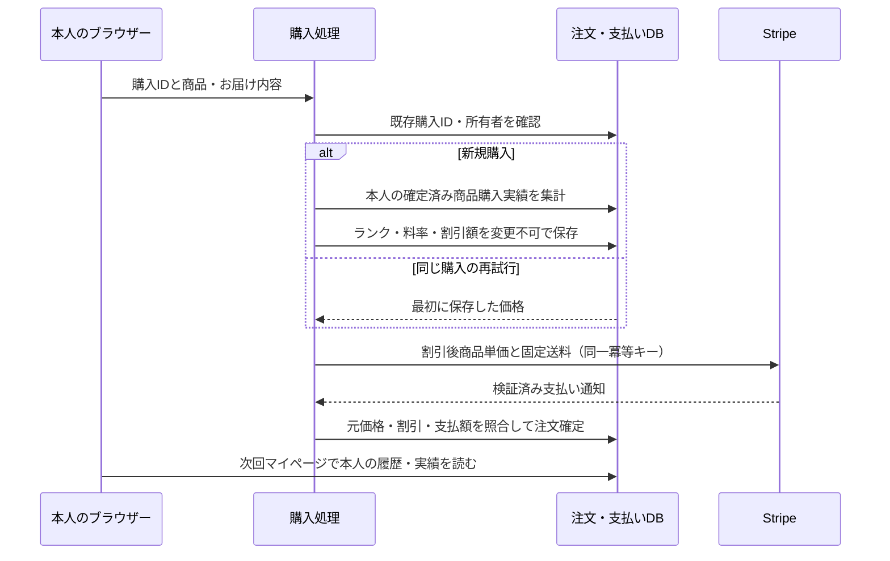

# 会員ランクと購入履歴

更新: 2026-09-14。設計の根拠・他社公式資料・計算条件は [ADR 0013](../architecture/adr/0013-customer-rank-discounts.md)。ユーザーはランク別自動割引を選択済み。ポイント交換式を再提案する必要はない。

## 実装

- `/account`: 本人の注文を新しい順に10件ずつ表示。購入時の商品名・注文数量、日付・金額・支払/発送状況、注文詳細へ進める。商品名は現在のカタログに置き換えない。
- 同じページで、全購入履歴に基づく商品購入実績・現在ランク・次のランクまでの金額・進捗・全ランク条件を表示。特典取得障害時も履歴を表示する。
- カートには現在の特典による見積もりを表示。購入手続きでサーバーが実績を確認して割引を固定する。クライアントのランク/金額を信頼しない。
- 初期案: SEED 0円/0%、SPROUT 12,000円/2%、BLOOM 30,000円/3%、BOUQUET 60,000円/5%。`customer/domain/customer-loyalty.ts` がv1規則。SQLのv1制約も防御用に同じルールを固定している。将来変更時は旧バージョンを保持し、新規則・migration・境界テストを同時追加する。
- 実績から送料・割引・確定返金を除く。返金配賦がないため送料返金を含め商品実績から先に差し引く。支払い保留・取消・全額返金・異議申立て・複数支払い・旧Shopify/未紐付け注文を対象外にする。払い戻し等で次回ランクが下がることがある。期限による失効なし。
- 運営者用CRMの権限/画面や紹介Test Modeの財布を拡張・共用していない。顧客ログインと運営者権限は別。

## 適用・復旧

1. バックアップと対象DBを確認し、通常のmigration手順で `0025_customer_loyalty_snapshot.sql` を適用する。既存取引の会員割引はNULL/0のまま。顧客の過去ランクを推測して書き込まない。
2. 新しいworkerとアプリを配備する。既存のアプリ/workerロールをそのまま使用し、権限や環境変数を追加しない。アプリは追加列をSELECTするため、migrationより先に配備しない。
3. 販売開始まで既存の本番受付停止と先行案表示を維持する。通常Preview購入ではこの割引を実決済に適用しない。
4. 問題時は新規受付を停止。migration・保存済み価格は残し、割引を解釈できるworkerで既存取引を精算する。旧workerに戻して割引額を無視しない。新規規則をオフにする場合も保存済み購入の復元は残す。

再試行は新しい購入IDを作らず、既存IDを使う。確定後にランクが変わっても元の請求を変更しない。顧客の実績が不明なときは、無断で通常価格に切り替えず再試行を案内する。この価格確認は決済の整合性に必要で、分析・推薦の障害とは分ける。

## 検証記録

- 通常テスト978件成功、既存DBテスト205件成功、新規DBテスト4件成功。全25 migrationの再適用・既存処理との互換を検証。
- 新規DBテストは、12注文の全件集計、別顧客/旧注文/未紐付けの除外、返品相当の返金/取消/異議申立て状態、権限障害、4並行作成、購入後のランク低下と再試行価格固定を確認。
- 注文4,000円・SPROUTの場合、Stripeへ3,920円＋送料1,000円を送ること、4,920円の通知だけを受け付けること、重複通知による注文/割引の重複がないこと、保留→成功→遅延した保留の返金通知で実績が巻き戻らないことを確認。Stripe SDKの通信先はスタブ。
- Chromium/WebKitで320/390/1280px、注文あり・注文なし・最高ランク・特典取得失敗・未ログインの30条件を確認。横溢れ・ページ実行エラーなし。実機iPhoneや読み上げの証明ではない。
- 合成セッションと隔離DBで2顧客の実アプリ `/account`、10件/次ページ2件でも48,000円の実績維持、相互の注文詳細非表示、private/no-store、アカウント無効化後の非表示を確認。この試験ではGoogle/Stripeへ接続していない。
- 型・lint・境界・migration・design/content方針チェックとビルド成功。依存追加なし、production依存監査で既知の脆弱性なし。

[スマホの表示](../design/verification/customer-loyalty/390.png) · [PCの表示](../design/verification/customer-loyalty/1280.png)。画像は明示的な架空データ。見本はpreview環境の `/preview/account`（`?state=empty`、`?rank=top`、`?rank=unavailable`）。productionではこの見本を公開しない。

## 販売前に残ること

料率・閾値の採算確認と条件の確定、実Google認証から実Stripeテスト決済・返金・再表示までの証跡、割引後の税・会計照合、旧注文を移行する場合の本人確認手順が必要。本番公開や実課金を完了したという記録ではない。[BACKLOG P1-13](BACKLOG.md)を更新し、後任は基盤を作り直さず残る証拠をそろえる。
