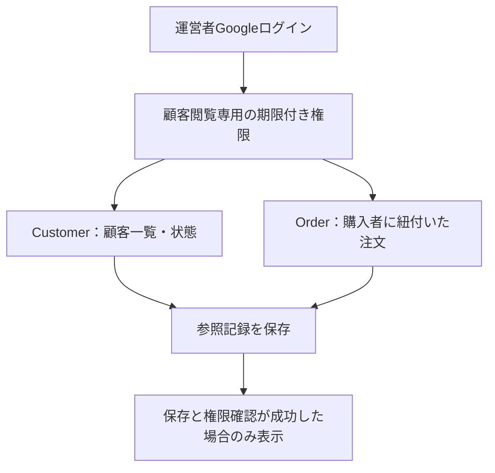

# 顧客管理

2026-09-14。対象：`/operations/customers` と `/operations/customers/[customerId]`。自作Commerceの運営者向け閲覧機能です。顧客用マイページとは別です。

## この段階でできること

- 顧客一覧、顧客ID・注文番号の完全一致検索、利用中／利用停止中／匿名化済みの絞り込み。
- 顧客一覧は1ページ30件、顧客ID順。購入履歴は1ページ20件、注文日時の降順（同日時は注文IDで安定化）。
- 購入者として紐付いた自作Stripe注文の注文番号・注文日・注文時金額・注文／支払／発送の状態を表示。
- 停止済み顧客はサポート確認のため参照可能。匿名化済み顧客の購入履歴は表示しない。
- 参照した運営者、操作種別、返却した顧客ID、日時を専用の監査テーブルへ保存。検索文字列や連絡先は保存しない。

氏名・メールアドレスの検索、連絡先登録、対応メモ、タグ、配信、CSV出力、アカウント停止操作、注文変更・返金操作は未実装です。Google認証時の氏名・メールは現行方針どおり台帳へ自動保存しません。ゲスト注文やメール一致による後付け紐付けもしません。

## 責任とアクセス

商品管理、発送管理、権限取消の権限から自動で顧客閲覧を許可しません。顧客ログインCookieも利用しません。専用DBロールは顧客・注文の変更、Google識別子・連絡先・住所・ギフト本文・決済先識別子の参照、閲覧記録の変更／削除を許可しません。

運営画面にリンクが表示されること自体は閲覧許可ではありません。専用権限のないアクセスはnot-found画面、接続・監査保存などの障害は取得失敗として表示し、空の顧客台帳として扱いません。

## 導入手順

1. 対象環境を確認し、migration用接続で `pnpm db:migrate` を実行する。追加は `0024_customer_management.sql` の権限表・権限確認関数・参照記録表。既存顧客・注文の変更やバックフィルはない。
2. migration管理者で `database/roles.sql` を適用する。専用ログインには `bloombox_customer_support` だけを付与し、アプリ／worker／DBオーナーの権限を併用しない。
3. 専用接続を `DATABASE_CUSTOMER_SUPPORT_URL` に設定する。SSL／プール数は既存の `DATABASE_SSL_MODE`／`DATABASE_MAX_CONNECTIONS` を使う。他の接続へのフォールバックはない。
4. [運営者Google認証](GOOGLE_OPERATOR_LOGIN.md) の設定と本人確認済みのoperator UUIDの対応を確認する。
5. DB管理者が承認済みoperator UUIDの `customer_support_operators` 行を作成する。`enabled=true`、現在より後の `valid_until` を指定する。既存担当者は自動登録されない。権限の自己付与画面はない。
6. 実環境でログイン→一覧→検索→履歴、権限無効化・期限切れ、取得失敗からの復旧を確認する。本番の担当者、参照目的、監査記録のアクセス・保持期限・削除手順は運用承認を得る。

この実装では本番DB移行、実運営者への権限付与、外部CRM契約・転送、本番販売の有効化を行っていません。

## 停止と復旧

権限表の対象行を `enabled=false` にし、進行中トランザクションの完了を待ちます。参照処理は共有ロックを保持し、終了時にもセッションと権限の期限を確認します。権限取消が完了した後の新規参照は拒否されます。

参照記録を保存できないときは画面に顧客情報を返しません。DB・権限・監査保存を復旧した後、再度参照します。停止中に注文・支払・在庫を変更する必要はありません。画面を戻す場合も、追加テーブルと監査記録を削除せず残します。

## 検証記録

- 通常テスト：顧客管理の認証入口、入力、接続分離、画面の空／エラー／匿名化、日付、状態、文字列エスケープを確認。
- 隔離PostgreSQL：migrationの再実行、専用ロール、検索とページ送り、他顧客／受取人のみ／ゲスト／旧Shopify注文の除外、停止／匿名化、混在する支払状態、権限なし／無効／将来／期限切れ、処理中のセッション失効、監査保存失敗と復旧を確認。
- 本番用ビルド成功。通常テスト956件成功。DB全体205件のうち、追加migrationに伴い既存試験の件数・バージョン期待値を更新し、該当ファイル7件の再実行成功（他198件は全体実行で成功）。
- Chromium／WebKitの320・390・768・1440pxで、横方向のはみ出しがないこと、検索→履歴、空／不正入力、未認証拒否、権限取消後の拒否、private/no-store・noindexを確認。架空顧客・注文、ローカル発行の合成運営者セッション、隔離DBを使用。実Google・実機Safari・本番HTTPS・実Stripe購入は未検証。
- 画面の証跡：[顧客一覧（デスクトップ）](../design/verification/customer-management/directory-desktop.png)、[購入履歴（スマホ幅）](../design/verification/customer-management/history-mobile.png)。どちらも架空データ。

設計判断：[ADR 0012](../architecture/adr/0012-customer-support-directory.md)。残作業の正本：[BACKLOG.md](BACKLOG.md) P1-01。
