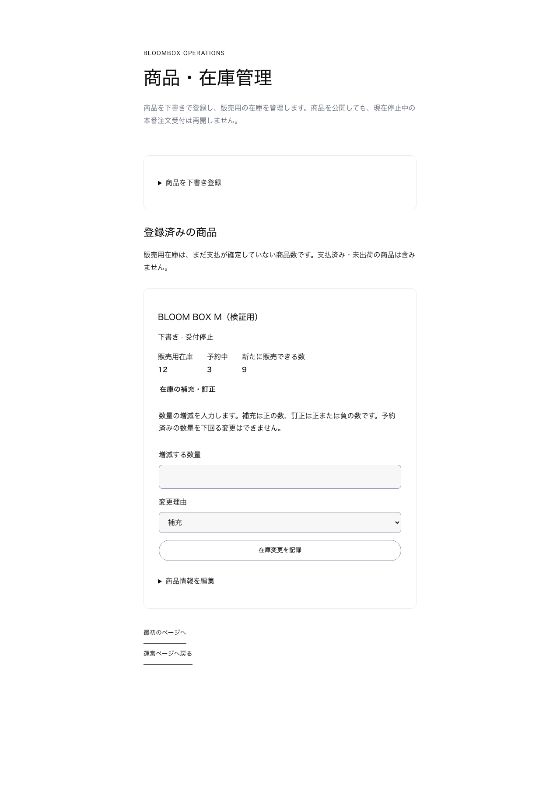

# 自作商品の運営管理

`/operations/catalog` で、商品を下書き登録・編集・公開・受付停止し、販売用在庫を補充・訂正します。[ADR 0011](../architecture/adr/0011-native-catalog-management.md) に基づく実装です。商品公開は、本番の新規注文受付停止を解除しません。

## 利用開始前の設定

1. 0022までのマイグレーションと `database/roles.sql` を適用します。旧アプリの在庫予約処理は変更せず共存できます。
2. `bloombox_catalog_manager` を持つ専用ログインの接続先を `DATABASE_CATALOG_MANAGER_URL` に設定します。SSLと接続数は既存のDB設定を使います。DBオーナーや注文用の接続は使いません。
3. 既存のGoogle運営者ログインと `AUTH_OPERATOR_BINDINGS` の主体対応を確認します。実際の環境変数名・設定形式は [運営者ログイン](GOOGLE_OPERATOR_LOGIN.md) と設定スキーマを確認してください。
4. DB管理者が、確認済みの運営者UUIDに対する `native_catalog_operators` の行を登録します。`enabled=true`、現在より後の `valid_until` が必要です。発送担当者や権限取消担当者には自動で許可されません。期限切れ・無効化は次回の読取・保存に反映されます。

管理画面から管理権限そのものを付与する機能はありません。Googleの設定・権限・接続は今回実環境へ追加していません。

## 商品と在庫の操作

- 新規商品は下書き・受付停止で作ります。名称・価格・画像URL・花材等を入力し、登録後の編集で公開します。受付可にする場合は公開状態も「公開」にしてください。
- 画像は既存の許可ホストのHTTPS URLだけを使用します。ローカルパス、任意サイトのURL、画像アップロードは受け付けません。現時点の許可先は `images.unsplash.com` です。
- 価格はJPYの整数です。価格変更は保存済み購入の価格スナップショットを書き換えません。用途・花材は1行に1項目です。公開かつ受付可の商品は既存カタログ上限の1,000件以内とします。
- 在庫未登録の商品は販売できません。在庫の補充で初期数を登録します。数量は実物と承認済み記録から確定し、テスト用数量を使いません。
- 補充は正の増分、数量訂正は正負の増分です。販売用在庫の上限は1,000,000、下限は予約中の数量です。予約数そのものは管理画面から変更できません。
- 販売用在庫は支払済み・未出荷を含みません。発送時に再度減らしたり、返金だけを根拠に補充したりしません。

各画面は30商品ずつ表示します。保存済みのフォームは再送できない状態になり、続ける場合は「最新の内容を読み直す」を使います。保存失敗時は入力を保持し、同じ内容・送信番号で再送できます。別の操作・購入予約でバージョンが進んでいたら、最新数を確認してから変更し直します。

## 履歴と復旧

`catalog_changes` は運営者・送信番号・変更前後のバージョン・変更前のスナップショット・保存内容・日時を記録します。`inventory_adjustments` は運営者・送信番号・数量の変更前後・増減・理由・日時を記録します。保存内容は商品情報だけで、個人情報や秘密情報を入力してはいけません。履歴一覧の専用画面は今回含みません。

同一送信番号の同一内容は重複更新せず、内容が異なる再送は拒否します。履歴保存の失敗では状態変更も取り消します。アプリ実行時権限は履歴の更新・削除や権限の自己付与を許可しません。

異常時はDB管理者が管理権限を無効化し、進行中トランザクションの完了を待ちます。誤った数量は予約数を確認したうえで新しい訂正として保存します。履歴削除、予約数の初期化、過去の価格スナップショットの書換えでは復旧しません。注文用・決済用の接続は停止しません。

## 今回の検証範囲

専用ローカルDBで、下書き登録、公開、同時再送、内容を変えた再送、古いバージョン、権限失効、処理途中のログイン期限切れ、予約数以下への訂正、購入との競合、履歴保存失敗時の全体取消、専用ロールの権限制限を検証しました。

実際のページ・フォームから合成データの静的HTMLを生成し、通常幅・320px幅の商品登録表示と競合時の案内を確認しました。CSSとDOMの確認であり、Google認証・実DB保存を通すブラウザーE2Eではありません。添付画像は同じ合成HTMLの通常幅キャプチャです。320px幅はブラウザー内で確認しました。

実環境の権限・専用接続・商品情報・価格・在庫登録、実Googleログインから保存までの確認、Stripeと出荷の接続確認は未完了です。
