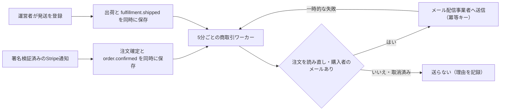

# 取引通知（購入者へのメール）

2026-09-19。コードは実装済み、初期状態は無効。設計判断は [ADR 0019](../architecture/adr/0019-transactional-notifications.md)。

## 送るメール

| 種類 | 送るタイミング | 主な内容 |
|---|---|---|
| 注文確認 | 決済が確定し、注文ができたとき | 受付番号、商品と数量、お届け予定日、合計金額（税込・送料込み）、マイページ・お問い合わせの案内 |
| 発送のお知らせ | 発送管理で「発送」を登録したとき | 受付番号、商品、配送会社、お問い合わせ番号 |

- 返金・取消：Stripeのメールを使う（ADR 0016）。Stripeダッシュボードの「メール」設定で、支払い成功のレシートと返金のメールを有効にする。
- 追跡番号の訂正・配達完了：メールを送らない。

文面は [content/notifications.json](../../content/notifications.json) にある。差し込みに使える値は、受付番号・商品名・数量・お届け予定日・合計・配送会社・お問い合わせ番号・マイページURL・お問い合わせURLだけ。受取人の情報や贈る言葉を差し込む項目はない（スキーマで拒否する）。

## 事業者が行う設定

1. **メール配信事業者のアカウントを作成する。** 例：[Resend](https://resend.com/)。無料枠は月3,000通・1日100通。これを超える場合は有料になるので、契約前に判断する。
2. **送信ドメインを認証する。** 例：`mail.<独自ドメイン>`。配信事業者の画面に表示されるSPF・DKIMのDNSレコードを登録し、DMARCも設定する。
3. **送信専用のAPIキーを作成する。** 権限は「送信のみ」、対象ドメインは上記に限定する。
4. **本番の環境変数をサーバー側だけに設定する（Gitには入れない）。**

   | 変数 | 内容 |
   |---|---|
   | `BLOOMBOX_NOTIFICATIONS_ENABLED` | `true` で有効。未設定または `false` なら送らない |
   | `NOTIFICATION_EMAIL_FROM` | 送信元。例：`BLOOM BOX <orders@mail.example.jp>`。認証済みドメインのアドレスにする |
   | `NOTIFICATION_EMAIL_REPLY_TO` | 任意。問い合わせ窓口のアドレス |
   | `RESEND_API_KEY` | `re_` で始まる送信用キー |
   | `BLOOMBOX_PUBLIC_ORIGIN` | 本番のHTTPS origin（メール内のリンクに使う） |

5. **商取引ワーカーを有効にする。** GitHubの変数 `STRIPE_RECONCILIATION_ENABLED=true` にする。送信は5分ごとのワーカーの中で行う。
6. **Stripeのメールを設定する。** レシートと返金メールを有効にする（返金の通知はこちらで行う）。

runtimeが `preview` の環境では、設定しても送信しない。Stripeのテストモードの注文も、本番runtimeでは実際のメールアドレスへ送る。テストでは自分のアドレスを入力する。

## 確認手順

1. 本番runtime・Stripeテストモードの隔離環境で、自分のメールアドレスで購入する。5分以内に注文確認メールが1通届くこと。
2. 発送管理で「発送」を登録する。発送のお知らせが1通届き、配送会社とお問い合わせ番号が正しいこと。
3. どちらのメールにも、お届け先の氏名・住所・贈る言葉が含まれないこと。
4. 監査ログに `notification.order_confirmed.sent` / `notification.order_shipped.sent` が1件ずつ残ること。
5. APIキーを一時的に無効にすると、イベントが再試行されること（`last_error_code = SEND_FAILED`）。キーを戻すと送信されること。

## 監視と対応

- ワーカーの応答に、件数だけの `notifications`（`sent` / `retried` / `failed` / `skipped`）が入る。無効のときは `{ "disabled": true }`、設定エラーのときは `{ "error": true }`。
- 送れなかったイベントは、`outbox_events` の `status = 'FAILED'` と `last_error_code` で確認する。
  - `NO_BUYER_EMAIL`：購入者のメールがない
  - `ORDER_NOT_ACTIVE`：注文が取消済みなど
  - `REJECTED`：配信事業者が拒否した
  - `RETRY_EXHAUSTED`：再試行の上限に達した
- 再送が必要な場合は、原因を解消してからお問い合わせ窓口で個別に連絡する。48時間を過ぎたイベントは自動では送らない。

## 未完了

- メール配信事業者の契約、送信ドメインの認証、APIキー、実際の送達の確認（事業者が行う）
- 文面の承認（販売者名・窓口の表記は P0-16）
- 注文データの保持期間（P0-17）。メールアドレスを含む注文の記録を削除した後は、通知を送れない。
